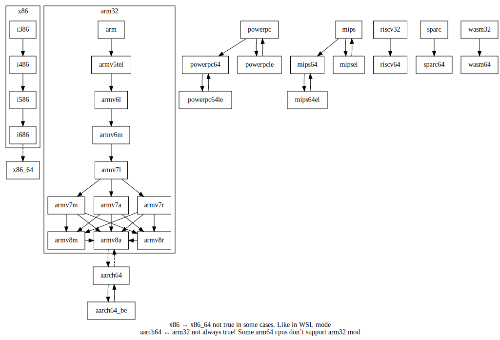

# 交叉编译和安装跨平台程序

nixpkgs原生支持x86和arm指令集。
通过对nixpkgs配置可以轻松实现交叉编译，
跨平台程序的安装等功能。

## 太长不看

* x86_64上的aarch64交叉编译器

  `(with import <nixpkgs> {crossSystem="aarch64-linux";}; stdenv.cc)`

* aarch64的hello应用程序

  `(with import <nixpkgs> {localSystem.system="aarch64-linux";crossSystem="aarch64-linux";}; hello)`

* 应用于nix-shell的例子

  [shell_cross_platform.nix](https://xieby1.github.io/scripts/index.html#shell_cross_platformnix)

## 目录

<!-- vim-markdown-toc GFM -->

* [简介](#简介)
* [`localSystem`和`crossSystem`的语法](#localsystem和crosssystem的语法)
  * [cpu-vendor-kernel-abi](#cpu-vendor-kernel-abi)
    * [cpu](#cpu)
      * [cpuTypes](#cputypes)
    * [vendor](#vendor)
    * [kernel](#kernel)
    * [abi](#abi)
* [`localSystem`和`crossSystem`的应用](#localsystem和crosssystem的应用)
  * [aarch64交叉工具链和程序的详细例子](#aarch64交叉工具链和程序的详细例子)
  * [mips交叉工具链的例子](#mips交叉工具链的例子)
* [引用](#引用)

<!-- vim-markdown-toc -->


## 简介

nixpkgs[^version]众多输入参数中，包含`localSystem`和`crossSystem`[^localSystem_crossSystem]。

* `localSystem`
  > The system packages will be built on.

  本地系统，即工具链运行的平台。
* `crossSystem`
  > The system packages will ultimately be run on.

  程序运行的平台。

通过`localSystem`和`crossSystem`不同值的组合，
可以实现交叉编译、安装其他架构的原生应用。
下面从`localSystem`和`crossSystem`的语法和应用两方面进行介绍。
语法章节从nixpkgs源码的角度出发，介绍其语法的组成。
应用章节围绕一个nix-shell脚本的实际例子，
介绍x86_64平台的交叉编译和安装aarch64架构的原生应用的方法。

## `localSystem`和`crossSystem`的语法

`localSystem`和`crossSystem`由4个维度去刻画一个系统：cpu, vendor, kernel, abi。
`localSystem`和`crossSystem`的值为字符串或者`{system=字符串;}`[^localSystem_crossSystem_type]。
system字符串为可以包含前述4个维度的1~4个维度。
nix在解析时会将省略的维度按以某些默认值补充完整。
维度之间之间用`-`分割。
因此system字符串形式上为`"cpu-vendor-kernel-abi"`。
字符串不同数量的维度及其可用的值，
按匹配优先级由高到低列举如下[^skeleton]，

### cpu-vendor-kernel-abi

| system字符串                     | cpu   | vendor   | kernel   | abi     |
|:--------------------------------:|:-----:|:--------:|:--------:|:-------:|
| "avr"                            | avr   |          | none     | unknown |
| "{cpu}-cygwin"                   | {cpu} |          | windows  | cygnus  |
| "{cpu}-windows"                  | {cpu} |          | windows  | msvc    |
| "{cpu}-elf"                      | {cpu} | unknown  | none     | elf     |
| "{cpu}-{kernel}"                 | {cpu} |          | {kernel} |         |
| "{cpu}-apple-{kernel}"           | {cpu} | apple    | {kernel} |         |
| "{cpu}-linux-gnu"                | {cpu} |          | linux    | gnu     |
| "{cpu}-{vendor}-mingw32"         | {cpu} | {vendor} | windows  |         |
| "{cpu}-{vendor}-wasi"            | {cpu} | {vendor} | wasi     |         |
| "{cpu}-{vendor}-redox"           | {cpu} | {vendor} | redox    |         |
| "{cpu}-{vendor}-mmixware"        | {cpu} | {vendor} | mmixware |         |
| "{cpu}-{vendor}-netbsd*"         | {cpu} | {vendor} | netbsd*  |         |
| "{cpu}-{vendor}-eabi"            | {cpu} | unknown  | {kernel} | eabi    |
| "{cpu}-{vendor}-eabihf"          | {cpu} | unknown  | {kernel} | eabihf  |
| "{cpu}-{kernel}-elf"             | {cpu} | unknown  | {kernel} | elf     |
| "{cpu}-*-{ghcjs}"                | {cpu} | unknown  | ghcjs    |         |
| "{cpu}-{vendor}-genode"          | {cpu} | {vendor} | genode   |         |
| "{cpu}-{vendor}-{kernel}-{abi} " | {cpu} | {vendor} | {kernel} | {abi}   |

#### cpu

cpu字符串可取的值列举如下[^cpuTypes],

| cpu字符串     | bits | significantByte | family   | version | arch      |
|:-------------:|:----:|:---------------:|:--------:|:-------:|:---------:|
| "arm"         | 32   | littleEndian    | "arm"    |         |           |
| "armv5tel"    | 32   | littleEndian    | "arm"    | "5"     | "armv5t"  |
| "armv6m"      | 32   | littleEndian    | "arm"    | "6"     | "armv6-m" |
| "armv6l"      | 32   | littleEndian    | "arm"    | "6"     | "armv6"   |
| "armv7a"      | 32   | littleEndian    | "arm"    | "7"     | "armv7-a" |
| "armv7r"      | 32   | littleEndian    | "arm"    | "7"     | "armv7-r" |
| "armv7m"      | 32   | littleEndian    | "arm"    | "7"     | "armv7-m" |
| "armv7l"      | 32   | littleEndian    | "arm"    | "7"     | "armv7"   |
| "armv8a"      | 32   | littleEndian    | "arm"    | "8"     | "armv8-a" |
| "armv8r"      | 32   | littleEndian    | "arm"    | "8"     | "armv8-a" |
| "armv8m"      | 32   | littleEndian    | "arm"    | "8"     | "armv8-m" |
| "aarch64"     | 64   | littleEndian    | "arm"    | "8"     | "armv8-a" |
| "aarch64_be"  | 64   | bigEndian       | "arm"    | "8"     | "armv8-a" |
| "i386"        | 32   | littleEndian    | "x86"    |         | "i386"    |
| "i486"        | 32   | littleEndian    | "x86"    |         | "i486"    |
| "i586"        | 32   | littleEndian    | "x86"    |         | "i586"    |
| "i686"        | 32   | littleEndian    | "x86"    |         | "i686"    |
| "x86_64"      | 64   | littleEndian    | "x86"    |         | "x86-64"  |
| "mips"        | 32   | bigEndian       | "mips"   |         |           |
| "mipsel"      | 32   | littleEndian    | "mips"   |         |           |
| "mips64"      | 64   | bigEndian       | "mips"   |         |           |
| "mips64el"    | 64   | littleEndian    | "mips"   |         |           |
| "mmix"        | 64   | bigEndian       | "mmix"   |         |           |
| "m68k"        | 32   | bigEndian       | "m68k"   |         |           |
| "powerpc"     | 32   | bigEndian       | "power"  |         |           |
| "powerpc64"   | 64   | bigEndian       | "power"  |         |           |
| "powerpc64le" | 64   | littleEndian    | "power"  |         |           |
| "powerpcle"   | 32   | littleEndian    | "power"  |         |           |
| "riscv32"     | 32   | littleEndian    | "riscv"  |         |           |
| "riscv64"     | 64   | littleEndian    | "riscv"  |         |           |
| "s390"        | 32   | bigEndian       | "s390"   |         |           |
| "s390x"       | 64   | bigEndian       | "s390"   |         |           |
| "sparc"       | 32   | bigEndian       | "sparc"  |         |           |
| "sparc64"     | 64   | bigEndian       | "sparc"  |         |           |
| "wasm32"      | 32   | littleEndian    | "wasm"   |         |           |
| "wasm64"      | 64   | littleEndian    | "wasm"   |         |           |
| "alpha"       | 64   | littleEndian    | "alpha"  |         |           |
| "msp430"      | 16   | littleEndian    | "msp430" |         |           |
| "avr"         | 8    |                 | "avr"    |         |           |
| "vc4"         | 32   | littleEndian    | "vc4"    |         |           |
| "or1k"        | 32   | bigEndian       | "or1k"   |         |           |
| "js"          | 32   | littleEndian    | "js"     |         |           |

##### cpuTypes

cpu之间的兼容性（具有传递性和自反性）如下[^isCompatible]，



#### vendor

vendor字符串可取值`"apple"`, `"pc"`(windows), `"w64"`(MinGW-w64), `"none"`, `"unknown"`(default)。

#### kernel

kernel字符串可取值如下表[^kernels]，

| kernel字符串 | execFormat | families |
|:------------:|:----------:|:--------:|
| "macos"      | macho      | darwin   |
| "darwin"     | ↑          | ↑        |
| "ios"        | macho      | darwin   |
| "watchos"    | ↑          | ↑        |
| "tvos"       | ↑          | ↑        |
| "freebsd"    | elf        | bsd      |
| "linux"      | elf        |          |
| "netbsd"     | elf        | bsd      |
| "none"       | unknown    |          |
| "openbsd"    | elf        | bsd      |
| "solaris"    | elf        |          |
| "wasi"       | wasm       |          |
| "redox"      | elf        |          |
| "windows"    | pe         |          |
| "win32"      | ↑          | ↑        |
| "ghcjs"      | unknown    |          |
| "genode"     | elf        |          |
| "mmixware"   | unknown    |          |

#### abi

abi字符串可取的值列举如下[^abis]，

| abi字符串      | float | abi | Note             |
|:--------------:|:-----:|:---:|:----------------:|
| "cygnus"       |       |     |                  |
| "msvc"         |       |     |                  |
| "eabi"         | soft  |     | for ARM, PowerPC |
| "eabihf"       | hard  |     | for ARM, PowerPC |
| "elf"          |       |     |                  |
| "androideabi"  |       |     |                  |
| "android"      |       |     | not 32-bit       |
| "gnueabi"      | soft  |     |                  |
| "gnueabihf"    | hard  |     |                  |
| "gnu"          |       |     | not 32-bit       |
| "gnuabi64"     |       | 64  |                  |
| "musleabi"     | soft  |     |                  |
| "musleabihf"   | hard  |     |                  |
| "musl"         |       |     |                  |
| "uclibceabihf" | soft  |     |                  |
| "uclibceabi"   | hard  |     |                  |
| "uclibc"       |       |     |                  |
| "unknown"      |       |     |                  |

## `localSystem`和`crossSystem`的应用

### aarch64交叉工具链和程序的详细例子

以x86为本地指令集，`localSystem`和`crossSystem`的组合有以下效果

| ↓`crossSystem`↓ →`localSystem`→ | "x86_64-linux"  | "aarch64-linux" |
|:-------------------------------:|:---------------:|:---------------:|
| "x86_64-linux"                  | 通常情况        |                 |
| "aarch64-linux"                 | 交叉编译aarch64 | 原生aarch64应用 |

因此基于这3种组合，可以在同一个shell环境中配置出3种软件，
[shell_cross_platform.nix](https://xieby1.github.io/scripts/index.html#shell_cross_platformnix)
的代码如下。

```nix
{{#include ../../scripts/nix/shell_cross_platform.nix}}
```

`pkgs_arm_cross`软件包的`stdenv.cc`为x86平台的arm交叉编译器。
nixpkgs channel只包含了原生x86应用和原生arm应用。
交叉编译的arm应用和原生arm应用的derivation不一样。
因此使用`pkgs_arm_cross`中的应用，
则会使用交叉编译器从源码开始编译arm应用，
而不是直接拉取nixpkgs channel的原生arm应用。

`pkgs_arm_native`软件包包含原生arm软件包。
从这个软件包拉取的应用和在arm平台的拉取到的应用一致。
例如`figlet`将直接从nix channel中拉取。

`pkgs`即x86原生的软件包。

shell_cross_platform.nix使用例子，

```bash
# 创建一个新的shell环境，包含stdenv.cc, figlet, qemu
$ nix-shell shell_cross_platform.nix

# 使用交叉编译工具链的c编译器
$ aarch64-unknown-linux-gnu-gcc helloworld.c -o helloworld
$ file helloworld
helloworld: ELF 64-bit LSB executable, ARM aarch64, version 1 (SYSV), dynamically linked, interpreter /nix/store/01kw0gb38phviarfv3fca49dpqh0qwlx-glibc-aarch64-unknown-linux-gnu-2.33-123/lib/ld-linux-aarch64.so.1, for GNU/Linux 2.6.32, with debug_info, not stripped

# arm原生应用
$ file `command -v figlet`
/nix/store/4f70f04bvd664n00jlnzccyzxd35lykw-figlet-2.2.5/bin/figlet: ELF 64-bit LSB executable, ARM aarch64, version 1 (SYSV), dynamically linked, interpreter /nix/store/rjc27shzir243n1w3127w713fijamf6v-glibc-2.33-123/lib/ld-linux-aarch64.so.1, for GNU/Linux 2.6.32, not stripped

# 直接执行figlet会出错
$ figlet
bash: /nix/store/4f70f04bvd664n00jlnzccyzxd35lykw-figlet-2.2.5/bin/figlet: cannot execute binary file: Exec format error

# 使用QEMU执行figlet即可
$ qemu-aarch64 `command -v figlet` miao!
           _             _
 _ __ ___ (_) __ _  ___ | |
| '_ ` _ \| |/ _` |/ _ \| |
| | | | | | | (_| | (_) |_|
|_| |_| |_|_|\__,_|\___/(_)
```

### mips交叉工具链的例子

```nix
{{##include ../../scripts/nix/shell_cross_mips.nix}}
```


## 引用

[^version]: nixpkgs版本2022.01.20, commit hash: 7e149abe9db1509fa974bb2286f862a761ca0a07

[^localSystem_crossSystem]: nixpkgs/pkgs/top-level/default.nix

[^localSystem_crossSystem_type]: nixpkgs/lib/systems/default.nix: `elaborate`

[^skeleton]: nixpkgs/lib/systems/parse.nix: `mkSkeletonFromList`

[^cpuTypes]: nixpkgs/lib/systems/parse.nix: `cpuTypes`

[^isCompatible]: nixpkgs/lib/systems/parse.nix: `isCompatible`

[^kernels]: nixpkgs/lib/systems/parse.nix: `kernels`

[^abis]: nixpkgs/lib/systems/parse.nix: `abis`

